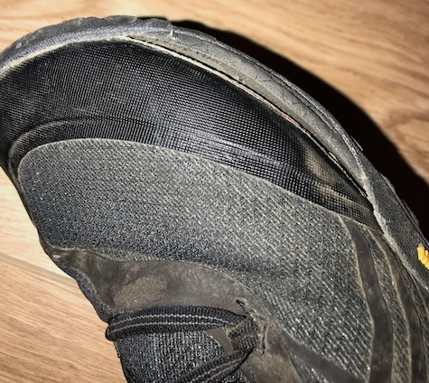

## Pre-plan

### Where/Why

I chose to go to Costa Rica for a few reasons:

*  It's winter in February in Washington DC and I wanted to go some place warm.
*  I found a good deal on plane tickets. 
*  I heard great things about the country.
*  I want to learn Spanish.
*  It offers both scenary/events as well as partying.

### Ticket Details

I purchased round trip tickets to Costa Rica from an app called Skyscanner. I chose the dates so one day will fall on a holiday for me and save a vacation day.

*  Round Trip Tickets Cost: $477 Each
*  Travel Dates: February 9-18 (10 Days)

**Depart**: Baltimore MD to Atlanta GA to San Jose, Costa Rica.

**Arrive**: San Jose to El Salvador to Washington DC.

### Packing Details

I planned on at least half of my time at the beach and the other half hiking, four wheeling, zip lines other outdoorsy events. I had two criteria to meet:

1.  Pack light enough to just use a carryon bag. 
2.  Pack enough to last 10 days.

When I know I am swimming at the beach or pool area I can reduce the number of socks and underware to take. Just reuse your bathing suit. However, a word of caution - *my clothes ended up smelling pretty bad*. In hindsight, just splurge about halfway through the trip and pay for laundry service. 

>  my clothes ended up smelling pretty bad

I am not going to go into packing details too much but I want to talk about proper footwear and how important this is. Keep in mind I want to pack light. I brought my typical going out shoes (New Balance skateboard shoes) and a pair of [Merrell Men's Trail Glove 4 Runner](https://www.amazon.com/gp/product/B01MS9J0YB/ref=ppx_yo_dt_b_asin_title_o00__o00_s00?ie=UTF8&psc=1) shoes.

These shoes were perfect for getting wet and for hiking jagged rocks. I even climbed a Ficus tree with them on. However, the shoes glue came off on edges as you can tell from the photo.

## Day 1 - San Jose

## Day 2 - San Hose to Jaco

## Day 3 - Jaco Beach

## Day 4 - Jaco Beach / Manual Antonio

## Day 5 - Jaco Beach

## Day 6 - Jaco to Monteverde

## Day 7 - Monteverde

## Day 8 - Monteverde to La Fatuna

## Day 9 - La Fatuna

## Day 10 - La Fatuna to San Jose

  

Pura Vida
